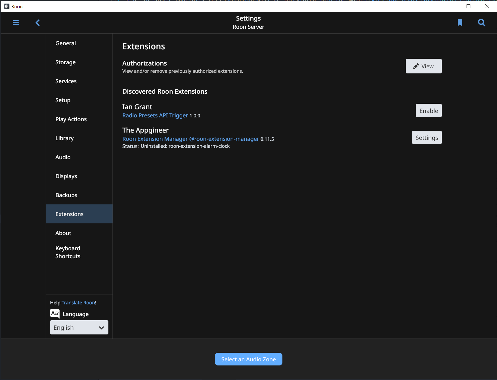
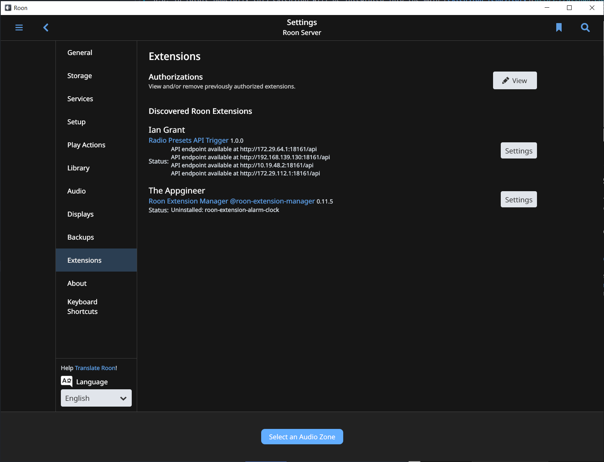
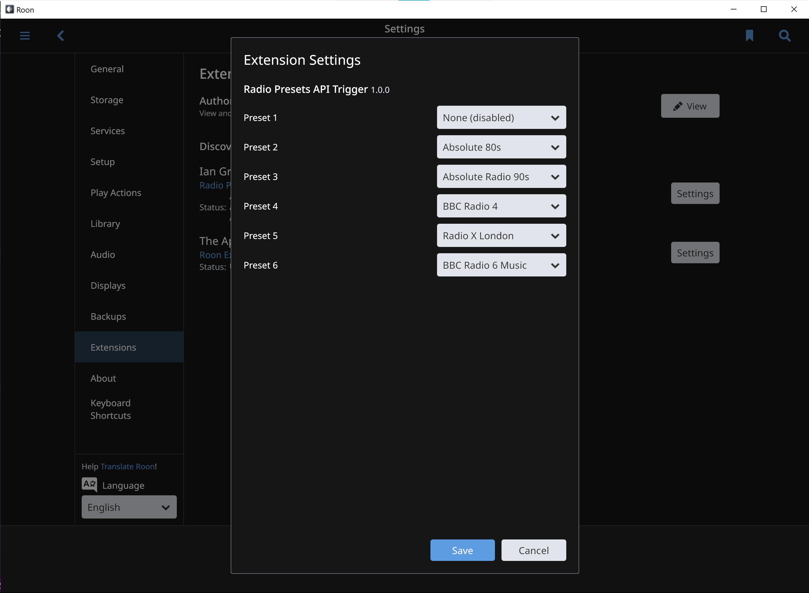

# Roon internet radio presets API trigger
A [Roon](https://roonlabs.com/) extension to play radio presets via an API trigger.

This extension was designed simply to enable the preset buttons on a [Squeezebox Radio](http://wiki.slimdevices.com/index.php/Squeezebox_Radio) to work when the radio is connected to a Roon core, rather than to [Logitech Media Server](http://www.mysqueezebox.com/download) (see below for how to enable this). You may also find other, similar applications for it.

## Pre-requisites
  - [Roon core](https://kb.roonlabs.com/Software_packages) (server), version 1.3 (build 192) or later
  - [Node.js](https://nodejs.org/), including the [NPM](https://www.npmjs.com/get-npm)

## Installation

### Using Roon Extension Manager
If you're using the [Roon Extension Manager](https://github.com/TheAppgineer/roon-extension-manager) to manage extensions for your Roon core, you can use that to install this extension by adding a [custom repository file](https://github.com/TheAppgineer/roon-extension-manager/wiki/Development) — copy the [`radio-presets-api.json`](repos/radio-presets-api.json) file to a `repos/` subdirectory on the system where your Roon Extension Manager is running, then use the Roon Extension Manager to [install the extension](https://github.com/TheAppgineer/roon-extension-manager/wiki).

n.b. in future hopefully this extension will be integrated into the main [extension repository](https://github.com/TheAppgineer/roon-extension-repository), in which case you can skip the first step of manually copying the repo file.

### Manual installation

  1. Install Node.js (see [pre-requisites](#pre-requisites)), check you're running Node.js 5.x or higher with: `node -v`
  2. Clone this git repository to a suitable location (where you will run the extension, usually the same system as your Roon core, although it need not be)
  3. Use `npm install` to install the required Express.js modules and dependencies, as well as the Roon APIs
  4. Test your server by launching the app with Node.js in a terminal:

      ```shell
      node .
      ```

      Alternatively, you can use [Visual Studio Code](https://code.visualstudio.com/) to launch an interactive debug session (the [Node Debug extension](https://marketplace.visualstudio.com/items?itemName=ms-vscode.node-debug2) is bundled with VS Code, and a `launch.json` configuration that runs the extension is included with this repository) — open the folder containing the cloned git repository in your workspace and press `F5` to start debugging (press `Ctrl+Shift+Y` to open the debug console).

      You should see some console output from the Roon APIs:

      ```json
      Extension server listening on 172.29.112.1:18161
      -> REQUEST 0 com.roonlabs.registry:1/info
      -> REQUEST 0 com.roonlabs.registry:1/info
      <- COMPLETE 0 Success {"core_id":"b51d89b2-8aa5-4561-9d72-aea2d5253682","display_name":"MyLaptop","display_version":"1.7 (build 571) stable"}
      -> REQUEST 1 com.roonlabs.registry:1/register {"extension_id":"me.iangrant.radio-presets-api","display_name":"Radio Presets API Trigger","display_version":"1.0.0","publisher":"Ian Grant","email":"ian@iangrant.me","required_services":["com.roonlabs.transport:2","com.roonlabs.browse:1"],"optional_services":[],"provided_services":["com.roonlabs.status:1","com.roonlabs.settings:1","com.roonlabs.pairing:1","com.roonlabs.ping:1"],"website":"https://github.com/imgrant/roon-extension-radio-presets-api","token":"33ea45f8-58fc-4bfb-8c85-9b2cd0a0ce97"}
      <- COMPLETE 0 Success {"core_id":"08d2ee54-0b84-4b2b-b574-1285600003b1","display_name":"Roon Server","display_version":"1.7 (build 571) stable"}
      -> REQUEST 1 com.roonlabs.registry:1/register {"extension_id":"me.iangrant.radio-presets-api","display_name":"Radio Presets API Trigger","display_version":"1.0.0","publisher":"Ian Grant","email":"ian@iangrant.me","required_services":["com.roonlabs.transport:2","com.roonlabs.browse:1"],"optional_services":[],"provided_services":["com.roonlabs.status:1","com.roonlabs.settings:1","com.roonlabs.pairing:1","com.roonlabs.ping:1"],"website":"https://github.com/imgrant/roon-extension-radio-presets-api","token":"0a16e48b-c522-41bb-9d6e-37791c978d78"}
      ```

      This indicates that the API has successfully connected to your Roon core, and has requested registration.

  5. To allow the extension to communicate with your Roon core, go to *Settings -> Extensions* in the Roon desktop app and click the *Enable* button next to the extension.

      

      After enabling the extension, the Node.js console will show further messages indicating the extension has registered with the Roon core:

      ```json
      <- CONTINUE 1 Registered {"core_id":"08d2ee54-0b84-4b2b-b574-1285600003b1","display_name":"Roon Server","display_version":"1.7 (build 571) stable","token":"7c7125d6-b62c-4b92-bbbb-e60d9ddc9654","provided_services":["com.roonlabs.transport:2","com.roonlabs.browse:1"],"http_port":9100}
      -> REQUEST 2 com.roonlabs.transport:2/subscribe_zones {"subscription_key":0}
      <- REQUEST 17 com.roonlabs.status:1/subscribe_status {"subscription_key":"261"}
      -> CONTINUE 17 Subscribed {"message":"API endpoint available at http://172.29.64.1:18161/api\nAPI endpoint available at http://192.168.139.130:18161/api\nAPI endpoint available at http://10.19.48.2:18161/api\nAPI endpoint available at http://172.29.112.1:18161/api","is_error":false}
      <- REQUEST 18 com.roonlabs.pairing:1/subscribe_pairing {"subscription_key":"262"}
      -> CONTINUE 18 Subscribed {"paired_core_id":"08d2ee54-0b84-4b2b-b574-1285600003b1"}
      ```

      The status message in the Roon app should also update to show the endpoint URL(s) for the API:

      

## Usage

### Preset configuration

To configure your presets, go to *Settings -> Extensions* in Roon and click the *Settings* button next to the extension. Use the dropdown menus to choose a radio station for any or all of the presets 1–6:



To deactivate a preset, choose the first option, *None (disabled)*.

If no radio stations are listed in the dropdown, make sure you have added some stations to your library, in the *My Live Radio* section in the Roon app — see the [Roon Knowledge Base article on Live Radio](https://kb.roonlabs.com/Live_Radio).

### Triggering presets via manual API calls

Once you have configured your presets, you can verify them by making an HTTP GET request against the API, using either a web browser or command line tool such as [`curl`](https://curl.haxx.se/) or [`wget`](https://www.gnu.org/software/wget/), for example:

```bash
ian@MyLaptop:/mnt/c/Users/ian$ curl -s http://172.168.139.130:18161/api?get_presets=true|jq
{
  "preset_1": "None (disabled)",
  "preset_2": "Absolute 80s",
  "preset_3": "Absolute Radio 90s",
  "preset_4": "BBC Radio 4",
  "preset_5": "Radio X London",
  "preset_6": "BBC Radio 6 Music"
}
```

To trigger one of the presets for a zone in Roon, the format of the API call is:

```http
http://[server]:[port]/api?zone=[zone-display-name-or-id]&preset=[preset-number]
```

...where:
  - `[server]` is the IP address or name of the system where the extension is running;
  - `[port]` is the TCP port the server is listening on (33161 by default);
  - `[zone-display-name-or-id]` is the display name or ID of the Roon zone. The display name must be [URL-encoded](https://www.w3schools.com/tags/ref_urlencode.ASP), e.g. *Living Room* becomes *Living+Room*;
  - `[preset-number]` is a digit, 1–6, representing which radio station to look up.

The zone should begin playing the radio station shortly after the preset is triggered. Check the console logs (if running manually via Node.js or in VS Code) for error messages if nothing happens.

## Acknowledgements

This extension is modelled after Varun Randery’s [roon-remote](https://github.com/varunrandery/roon-remote), it is basically the same code for a Node.js Express server, extended to the concept of radio presets.

Jan Koudijs’s (“[The Appgineer](https://github.com/TheAppgineer)”) [Roon extension manager](https://github.com/TheAppgineer/roon-extension-manager) and numerous extensions also served as a stand-in for the official Roon API documentation on how to write settings panes, etc for Roon extensions.